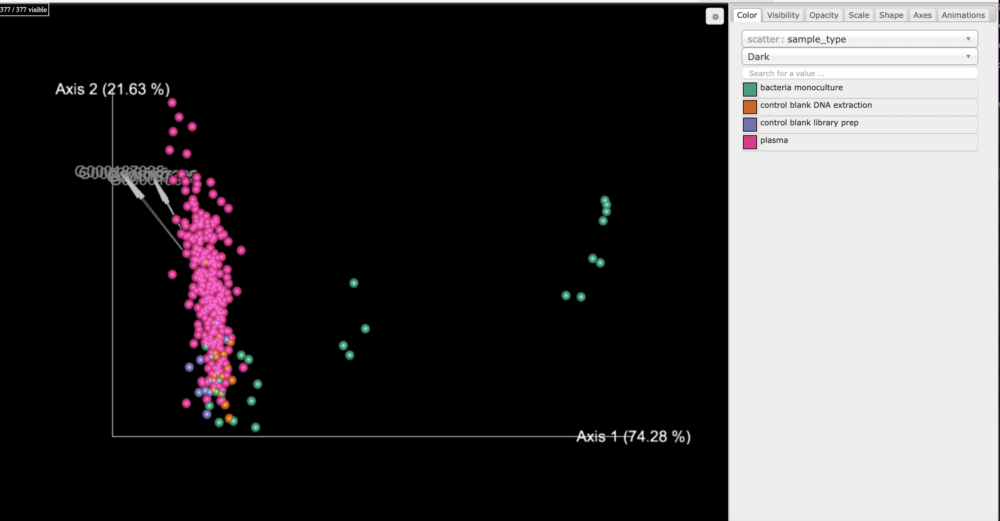
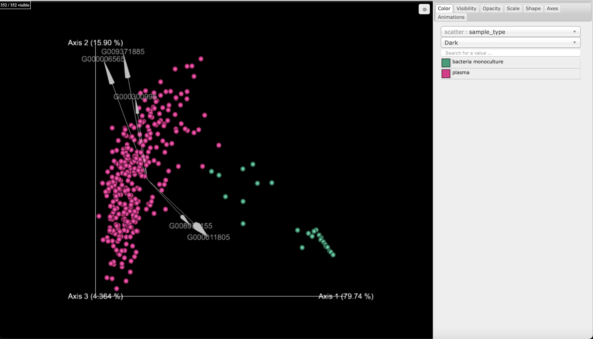

<style>
    body { background-color: #162138;
            text-color: whitesmoke}
</style>


--------------------------

# Getting ready

In this tutorial we use _SCRuB_ to decontaminate a dataset comparing the plasma samples of cancer and control subejcts published in [Poore et al](https://www.nature.com/articles/s41586-020-2095-1). This data can be downloaded with the following links:

* **Table** (table.qza) | [download](https://github.com/korem-lab/q2-SCRuB/blob/master/ipynb/plasma-data/table.qza)
* **Sample Metadata** (metadata.tsv) | [download](https://github.com/korem-lab/q2-SCRuB/blob/master/ipynb/plasma-data/metadata.tsv)


**Note**: This tutorial assumes you have installed [QIIME2](https://qiime2.org/) using one of the procedures in the [install documents](https://docs.qiime2.org/2020.2/install/). This tutorial also assumed you have installed [SCRuB](https://korem-lab.github.io/SCRuB/).

First, we will make a tutorial directory and download the data above and move the files to the `plasma-data` directory:

```bash
mkdir plasma-data
```

# Decontaminating 

To run SCRuB we only need a single command, whose inputs and parameters are described [here](qiime2-intro.html). In this tutorial our control_idx_column parameter is `is_control`, our sample_type_column is `sample_type`, and our well_location_column is `well_id`. Now we are ready to SCRuB away the contamination:

```{python, eval=FALSE}
!qiime SCRuB SCRuB \\
    --i-table plasma-data/table.qza \\
    --m-metadata-file plasma-data/metadata.tsv \\
    --p-control-idx-column is_control \\
    --p-sample-type-column sample_type \\
    --p-well-location-column well_id \\
    --p-control-order NA \\
    --o-scrubbed results/scrubbed.qza
```


# Assessing output

Now we can compare the raw table and SCRuB's output:

```{python, eval=FALSE}
import os
import warnings
import qiime2 as q2
# hide pandas Future/Deprecation Warning(s) for tutorial
warnings.filterwarnings("ignore", category=DeprecationWarning) 
warnings.simplefilter(action='ignore', category=FutureWarning)

# import table
table = q2.Artifact.load('plasma-data/table.qza')\
# import metadata
metadata = q2.Metadata.load('plasma-data/metadata.tsv')
# import SCRuB output
scrubbed = q2.Artifact.load('results/scrubbed.qza')

```


```{python, eval=FALSE}
from qiime2.plugins.deicode.actions import rpca
from qiime2.plugins.emperor.actions import (plot, biplot)
```


```{python eval=FALSE}
# run RPCA and plot with emperor
rpca_biplot, rpca_distance = rpca(table)
rpca_biplot_emperor = biplot(rpca_biplot, metadata)
# make directory to store results
output_path = 'results'
if os.path.isdir(output_path)==False:
    os.mkdir(output_path)

# now we can save the plots
rpca_biplot_emperor.visualization.save(os.path.join(output_path, 'Raw-RPCA-biplot.qzv'))

```


Now we can visualize the samples via RPCA    




For comparison, we can observe the samples decontaminated by SCRuB. Note that the decontamination increased the observed separation between the plasma samples and the bacterial monocultures:

```{python eval=FALSE}
# run RPCA and plot with emperor
rpca_biplot, rpca_distance = rpca(scrubbed)
rpca_biplot_emperor = biplot(rpca_biplot, metadata)

# save the plots
rpca_biplot_emperor.visualization.save(os.path.join(output_path, 'SCRuBbed-RPCA-biplot.qzv'))
```




