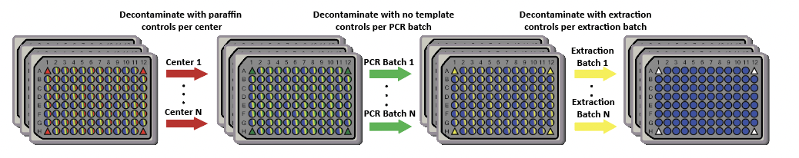

---
title: 'SCRuB: Source-tracking for Contamination Removal <br> &emsp;&emsp;&emsp;&emsp; in *micro*Biomes'
output: 
    html_document:
       theme: darkly
---
<style>
    body { background-color: #162138;
            text-color: whitesmoke}
</style>


</center>

--------------------------

**<span style="color:lightblue">We are currently in beta testing! Please report any issues you faced while using SCRuB in our [Issues Page](https://github.com/korem-lab/SCRuB/issues).</span>**

--------------------------

## Installation

SCRuB is currently available through its github repository, which can be installed using `devtools`. The two main package requirements from SCRuB are `glmnet` and `torch`, which can be installed with the following command:

```S
install.packages( c('glmnet', 'torch') )
```

Once the dependencies are met, SCRuB can be installed as follows:
```S
devtools::install_github("korem-lab/SCRuB")
```

&nbsp;

## Getting started

**<span style="color:lightblue">To start using SCRuB, we recommend to follow along with our [tutorial](tutorial.html). This notebook demonstrates the data format needed to set up SCRuB, how to run SCRuB's core funtions, and how to interpret its results.:</span>** 

&nbsp;

## FAQs
*What data does SCRuB need?*

*What are SCRuB's advantages? (what is it's secret sauce?)*

*How should I use SCRuB if I want to remove multiple types of contamination?*


&nbsp;

