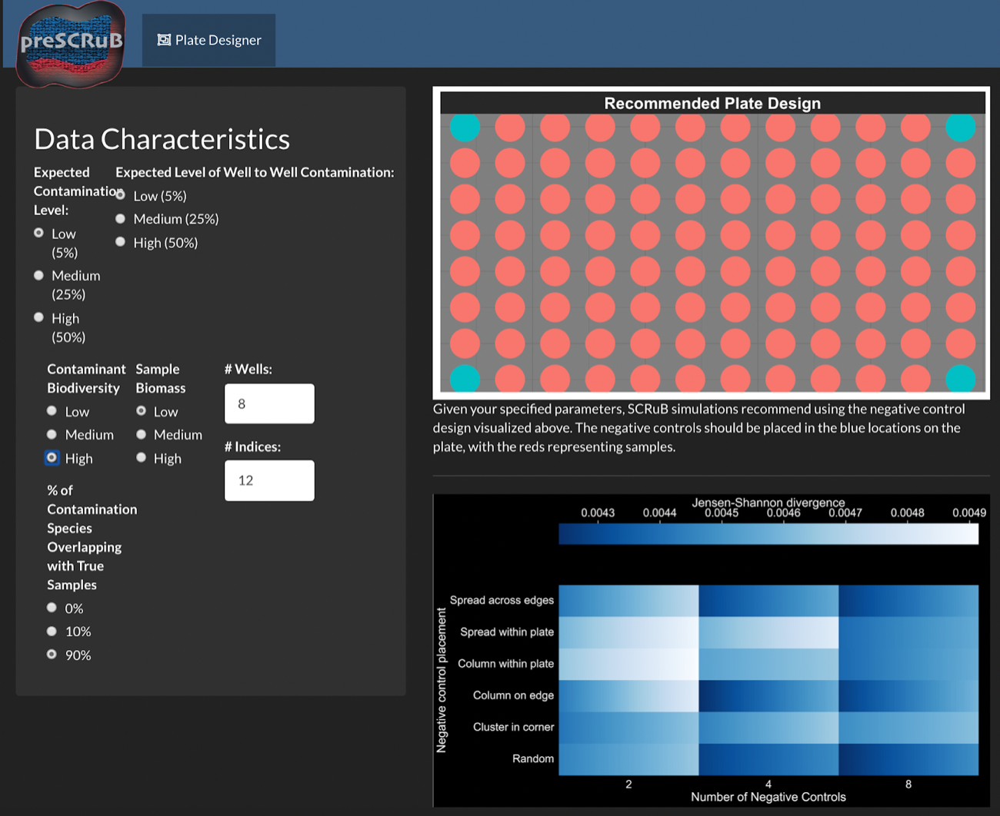
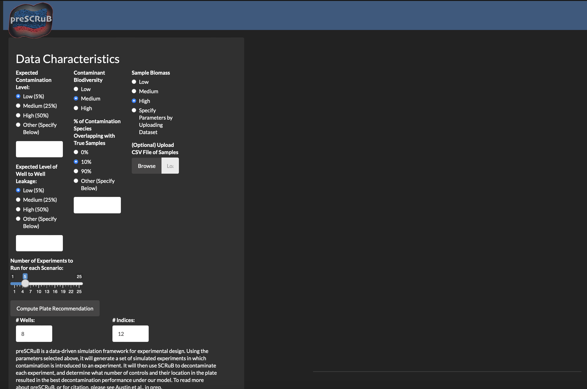
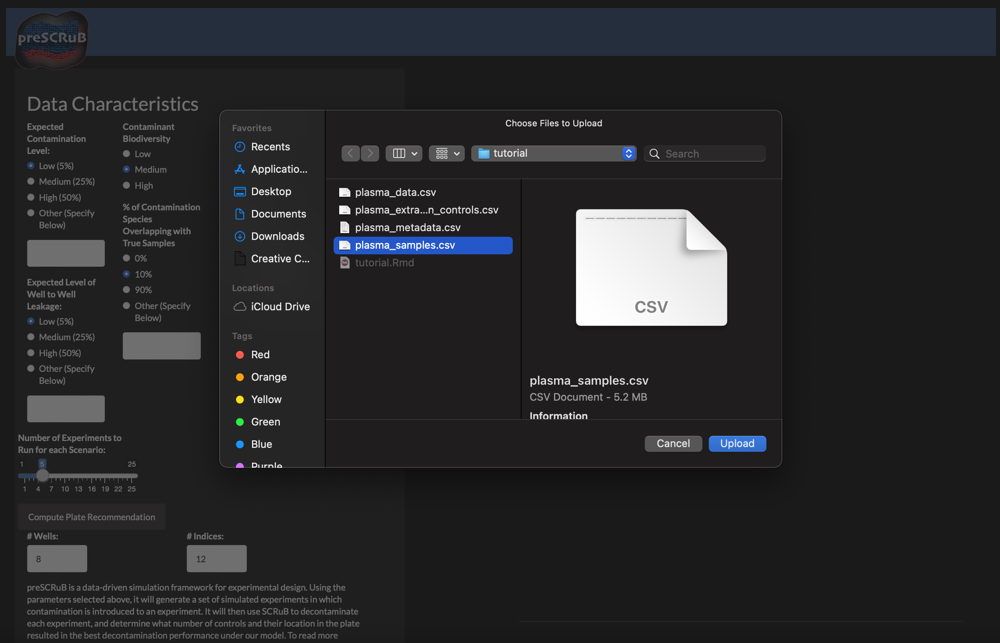
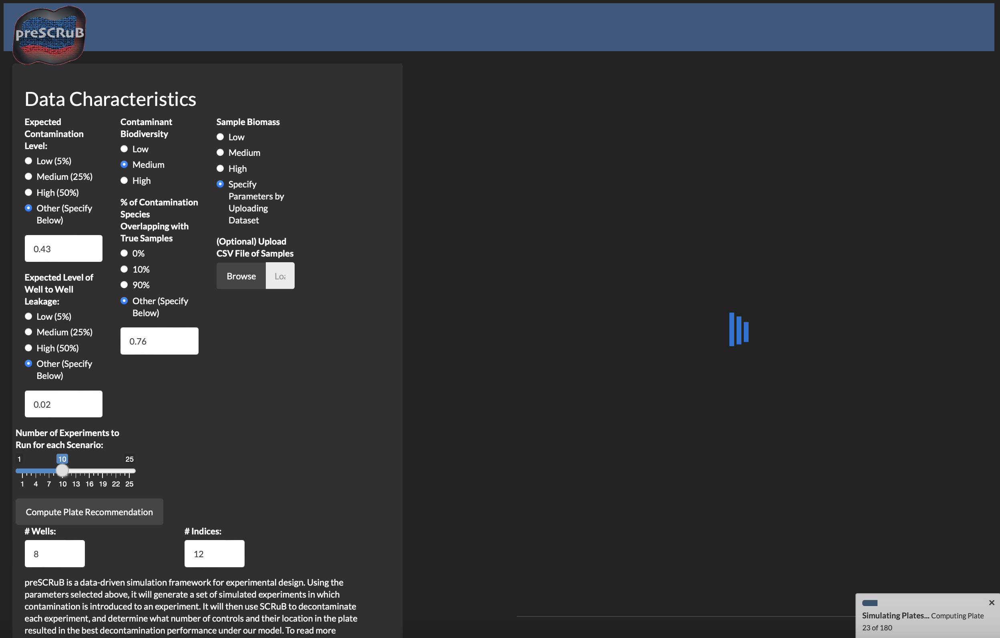

<style>
    body { background-color: #162138;
            text-color: whitesmoke}
</style>


</center>

--------------------------


## Welcome to preSCRuB
PreSCRuB is a tool for providing **<span style="color:lightblue">recommendations for experimental design**, **<span style="color:lightblue">number of control samples** to collect, and **<span style="color:lightblue">where to place them** on a sequencing plate. Use of preSCRuB during the experimental design process will allow for stronger downstream applications of SCRuB. These recommendations are computed by simulating thousands of microbiome experiments, and **<span style="color:lightblue">identifying the scenarios in which SCRuB performs best**.

<br><br>
To obtain preSCRuB's recommendations, the minimum information needed is a set of assumptions regarding your data. More refined preSCRuB recommendations can be implemented through installing our preSCRuB package.
<br>

## Getting started

preSCRuB is currently available through two avenues:

1) A publicly available **<span style="color:lightblue">Rshiny application**, hosted [here](https://prescrub.shinyapps.io/shinyApp/). This is the fastest option, and recommended for first-time users. <br>
2) A package, which can be used to **<span style="color:lightblue">locally host an Rshiny application** to run simulations for user-specific study parameters. While this option takes longer, it allows for user-inputted datasets to be incorporated during the simulations, and therefore provides highly personalized recommendations.

&nbsp;

## preSCRuB on Rshiny

In the [Rshiny app](https://prescrub.shinyapps.io/shinyApp/), you will observe the interface shown below. By adjusting the various parameters, you can obtain our plate design recommendation (upper right-hand panel), and heatmaps summarizing the results across their simulation parameters (bottom right). The parameters include the expected diversity of the samples of interest, the diversity of the contamination source, the expected taxonomic similarity between the contamination source and the samples of interests, and the expected levels of contamination and well-to-well leakage.




## preSCRuB on your machine

### Starting preSCRuB Locally
In some cases, it may be advantageous to run preSCRuB simulations on even more specific situations, such as when you have pilot data. To support such use cases, we offer the option to run preSCRuB on your machine. To do this, begin by installing the SCRuB package, as described on the [home page](index.html). Next, from an R environment, install the additional preSCRuB prerequisites:
```{r, eval=FALSE}
install.packages( c('shiny','DT','ggrepel','shinycssloaders','shinythemes','philentropy','gridExtra','Pareto','cowplot','golem') )
devtools::install_github('biobakery/SparseDOSSA2')
```

Once the prerequisites are installed, from the command line you can clone the preSCRuB repository, and run the application:
```bash
git clone https://github.com/korem-lab/preSCRuB.git
Rscript -e 'library(methods); shiny::runApp("preSCRuB/ShinyApp/", launch.browser = TRUE)'
```
The following window will pop up. This window contains the same set of parameters in the public Rshiny app, with the additions of 1) free text inputs for other parameters, 2) optional upload button to run simulations on data similar to your data of interest (e.g., pilot data), and 3) a bar to control the number of simulations to run.



### Uploading user samples
For a user to upload samples, select the browse button to search through your local machine and choose a file of sample read counts in `.csv` file, in in a 1-row-per-sample format. In this example, we use the plasma data from the SCRuB tutorial (available in our [github repository](https://github.com/korem-lab/SCRuB/])). We recommend that users ensure their data foramt matches those that we supply.



### Running simulations
Once content with the specified preSCRuB parameters, click on the `Compute Plate Recommendations` to start running the simulations to evalute SCRuB's performance across different plate design parameters. While the simulations are running, a loading icon will be displayed as follows:




