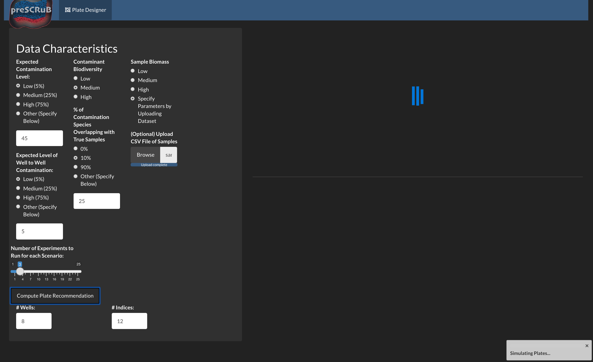

---
title: 'preSCRuB: a model-informed framework for study design recommendations'
output: 
    html_document:
       theme: darkly
---
<style>
    body { background-color: #162138;
            text-color: whitesmoke}
</style>


</center>

--------------------------

**<span style="color:lightblue">We are currently in beta testing! Please report any issues you faced while using SCRuB in our [Issues Page](https://github.com/korem-lab/SCRuB/issues).</span>**

--------------------------

## Welcome to preSCRuB

`PreSCRuB` is a tool for producing **<span style="color:lightblue">study design recommendations**, in terms the **<span style="color:lightblue">number of control samples** to collect, and **<span style="color:lightblue">where to place them** on a sequencing plate. Use of `preSCRuB` during the study design process will allow for stronger downstream applications of `SCRuB`. These recommendations are computed by simulating thousands of microbiome batches, and **<span style="color:lightblue">identifying which scenarios `SCRuB` performs best for**
<br><br>
To obtain `preSCRuB`'s recommendations, the minimum information needed is a set of assumptions regarding your data. More refined `preSCRuB` recommendations can be implemented through installing our `preSCRuB` package.
<br>
## Getting started
preSCRuB is currently available through two avenues:

1) A publicly available **<span style="color:lightblue">Rshiny application**, hosted [here](). This is the fastest option, and recommended for first-time users. <br>
2) A package, which can be used to **<span style="color:lightblue">locally host an Rshiny application** to run simulations for user-specific study parameters. While this option takes longer, it allows for user-inputted datasets to be incorporated during the simulations and highly personalized recommendations. 

&nbsp;

## preSCRuB on Rshiny

From the [Rshiny app](), users will observe the  user interface shown below. From adjusting the radio buttons, users can obtain our plate design recommendation (upper right-hand panel), and heatmaps summarizing the results across their simulation parameters. The user-facing parameters include the expected diversity of their samples of interest, the diversity of the contamination source, the expected taxonomic similarity between the contamination source and the samples of interests, and the levels of contamination and well-to-well leakage


## preSCRuB on your machine

### Starting preSCRuB Locally
To run preSCRuB on your machine, begin by installing the SCRuB package, as described on the [home page](index.html). Next, from an R environment, run the following:
```{r, eval=FALSE}
library(SCRuB)
preSCRuB()
```
The following window will pop up. This window contains the same set of parameters in the public Rshiny app, with the additions of 1) free text inputs for other parameters, 2) optional upload button to run simulations on data similar to the subject of the `preSCRuB` users' prospective study, and 3) a bar to control the number of simulations to run.


### Uploading user samples
For a user to upload sample, select the browse button to search through their local machine and choose a file of sample read counts in `.csv` file, in in a 1-row-per-sample format. In this example, we use the hosptial data from the SCRuB tutorial (available in our [github repository](https://github.com/korem-lab/SCRuB/])). We recommend that users ensure their data foramt matches those that we supply.


### Running simulations
One content with the specified `preSCRuB` parameters, users can click on the `Compute Plate Recommendations` to start running the simulations to evalute SCRuB's performance across different plate design parameters. While the simulations are running, a loading icon will be displayed as follows:




